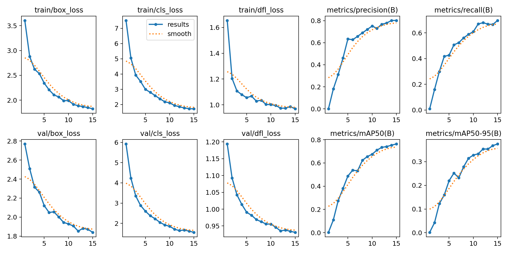
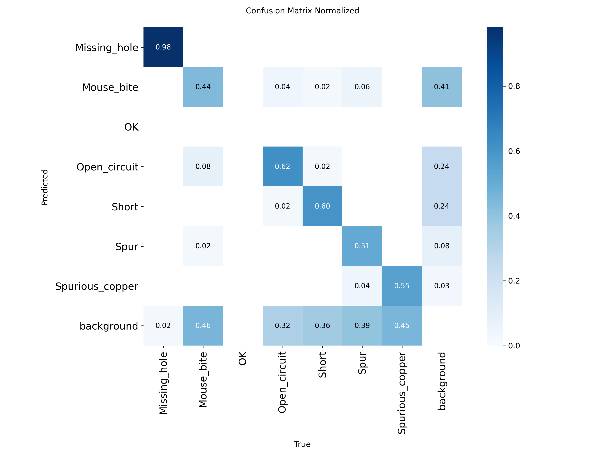
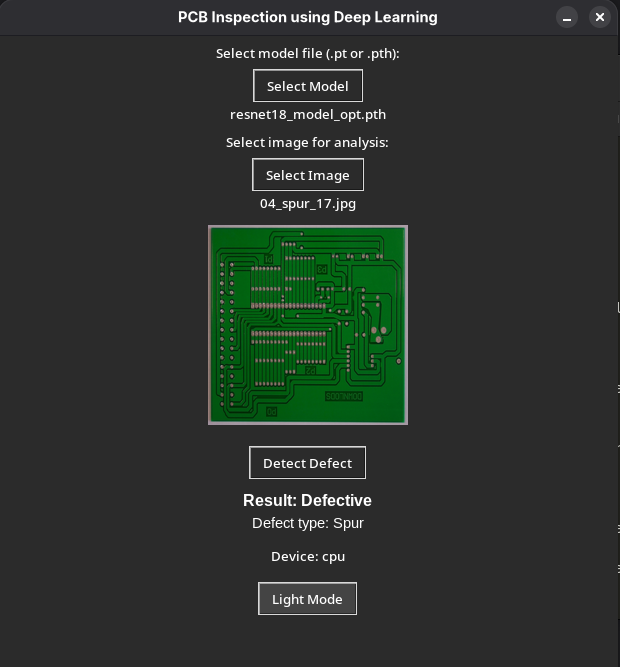

# PCB Defect Detection using Deep Learning

This project focuses on detecting defects and incorrect connections in PCB (Printed Circuit Boards) using deep learning techniques.

---

## Project Goal

The main objective of this project was to design and evaluate multiple deep learning approaches for PCB defect detection and to perform a **comparative analysis of different neural network architectures**.

The study includes both:

- image classification models
- object detection approach (YOLOv8)

---

## Research Approach

This project is not only an implementation but also a **technology review and comparison of modern deep learning architectures** applied to PCB inspection.

Different models were trained and evaluated under the same conditions to analyze:

- accuracy
- generalization capability
- suitability for industrial applications

---

## Dataset

The dataset used in this project is based on a publicly available PCB defect detection dataset:

- https://universe.roboflow.com/pcbdataset/pcb-defect-detection-9ewqw

The dataset contains approximately **700 images** divided into 7 defect classes:

- Missing_hole
- Mouse_bite
- OK
- Open_circuit
- Short
- Spur
- Spurious_copper

Images were resized to:

- 256x256 (classification models)
- 640x640 (YOLOv8)

Important limitation:
The dataset contains a relatively small number of samples and limited diversity (images from a small number of PCB boards), which negatively affects model generalization and leads to overfitting.

---

## Models Overview

### MLP (256 neurons)

A simple fully connected neural network used as a baseline model.

- no spatial feature extraction
- very limited performance
- accuracy: **10%**

---

### Custom CNN

Basic convolutional neural network designed for feature extraction.

- detects edges and local patterns
- lightweight architecture
- accuracy: **30%**

---

### ResNet18

Residual neural network using skip connections.

- solves vanishing gradient problem
- allows deeper learning
- accuracy: **30%**

---

### EfficientNet-B0 / B1

Modern architecture optimized for performance vs efficiency.

- compound scaling (depth, width, resolution)
- efficient but sensitive to dataset quality
- accuracy:

  - B0: **10%**
  - B1: **20%**

---

### MobileNetV2

Lightweight model designed for embedded systems.

- optimized for low computational cost
- suitable for real-time applications
- accuracy: **20%**

---

### DenseNet121

Architecture with dense connections between layers.

- strong feature reuse
- improved gradient flow
- accuracy: **20%**

---

## Classification Results Summary

| Model             | Accuracy |
| ----------------- | -------- |
| ResNet18          | 30%      |
| CNN (custom)      | 30%      |
| MobileNetV2       | 20%      |
| DenseNet121       | 20%      |
| EfficientNet-B1   | 20%      |
| EfficientNet-B0   | 10%      |
| MLP (256 neurons) | 10%      |

---

## Analysis of Results

Despite using advanced architectures, classification accuracy remained low.

### Main reasons:

- low dataset diversity
- repeated defect locations
- overfitting to background patterns

This confirms that:
- model architecture was NOT the main limitation
- dataset quality was critical 

---

## Transition to Object Detection (YOLOv8)

Due to poor classification performance, the approach was changed to **object detection**.

YOLOv8 allows:

- defect localization
- detection of multiple defects
- better generalization

---

## YOLOv8 Results

- mAP@0.5: **76.4%**
- mAP@0.5:0.95: **44.1%**
- Precision: **78.3%**
- Recall: **68.2%**
- F1-score: **0.74**

- Significant improvement compared to classification models 

---

## Key Insight

The project demonstrates that:

> For PCB defect detection, **object detection approaches (YOLO)** are significantly more effective than pure classification models.

---

## Example Results

### YOLO Detection


### Confusion Matrix


### Example PCB Defect (Spur)


## Application

A GUI application was developed in Python:

## Technologies & Libraries

### Core Libraries

- PyTorch – deep learning framework
- torchvision – pretrained models and image transformations
- Pillow – image processing
- pandas – data handling and analysis
- matplotlib – visualization

---

### Python Standard Libraries

The following libraries are part of Python and do not require installation:

- `os` – file system operations
- `time` – time measurement and performance tracking

---

### GUI

- `tkinter` – used for building the graphical user interface

**Note:**

`tkinter` is included with Python, but on some Linux distributions it must be installed manually.

#### Installation by system:

**Debian / Ubuntu:**

```bash
sudo apt install python3-tk
```

**Fedora:**

```bash
sudo dnf install python3-tkinter
```

**Arch Linux:**

```bash
sudo pacman -S tk
```

---

### Additional Tools

- YOLOv8 – object detection framework for PCB defect localization


### Features:

- load trained model (.pth)
- upload PCB image
- classify defect type
- detect defect location
- visualize results

---

## Practical Applications

- Automated Visual Inspection (AVI)
- PCB manufacturing quality control
- defect detection before assembly
- reduction of faulty products

---

## Future Work

- increase dataset diversity
- apply data augmentation
- use segmentation models
- test larger YOLO architectures (YOLOv8-s, YOLOv8-m)

---

## Authors

Hubert Jabłoński,
Jakub Czekaj
